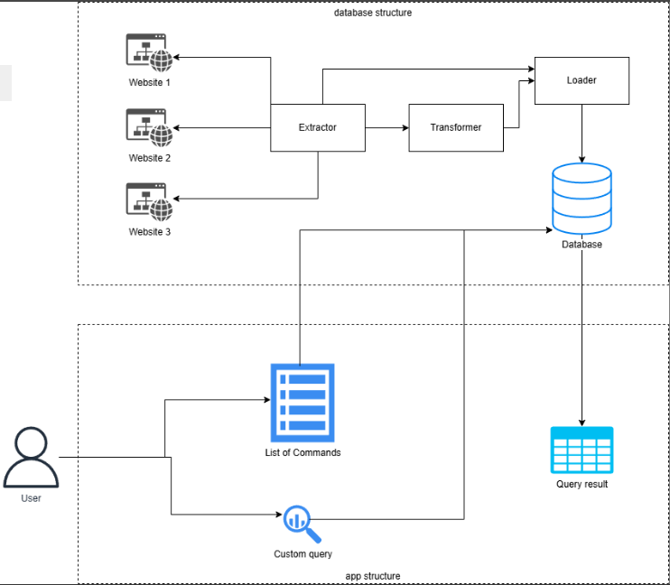

# Game Character Data Extraction with ETL

Welcome to my first data engineering project, which consists of an ETL pipeline involving data of game characters and an app where you can play with the data using SQL queries.

## Overview

This project is composed of two parts. The first part is an ETL pipeline focused on extracting, transforming, and loading data of playable characters from the following games:
- *Genshin Impact*
- *Honkai: Star Rail*
- *Overwatch 2*
- *Wuthering Waves*
- *Zenless Zone Zero*

This ETL extracts character data from their respective Fandom Wiki entries, makes the necessary transformations, and stores them in three distinct databases. It can either be run as a simple Python script (`etl_main.py`) or as an Airflow DAG (`etl_main_dag.py`, located at `airflow/dags`).

The second part is a simple app created using the `streamlit` library.

The image below illustrates how the project was modelled.

## Used tools

To create this project, the following tools were used:
- `BeautifulSoup` to perform data scraping
- PostgreSQL (Version 17) to create the databases
- `apache-airflow` package to create, run and manage DAGs
- `streamlit` library to build the app
- WSL to run Airflow DAGs

## Project step-by-step

The first thing I considered in my project development was selecting the games I wanted to extract character data from. I picked these five games for three reasons:

1. They're popular.
2. They have a good amount of characters each.
3. Their data is relatively easy to extract.

In fact, Overwatch 2 replaced another game I had in my mind for the very same reasons, especially the third one.

After picking the games, I needed to select which data I wanted to extract. Considering each game has their own mechanics and classes, I went with the simplest route, which was picking generic information, like name, gender, region and release date. Once I defined the data to extract, I created the extract block of my ETL pipeline and spent some time testing it, taking the adequate caution to prevent being detected by anti-scraping systems. 

When I finished creating and validating the extractor, I analysed the retrieved data and created the transform block accordingly so that they all shared the same format. Then, I created and tested another transform block to fit the data to a star schema, where both gender and region were assigned to dimension tables and name and release date were assigned to facts tables. Regarding Honkai: Star Rail and Zenless Zone Zero, their dimensions were gender and faction instead. This way, each game now had its own star schema.

At this moment I started creating the databases where the character data, now as a set of 5 star schemas, would be stored. I decided to name each database after the companies which developed and/or owned the rights over the games. Because three games belonged to the same company (*Genshin Impact*, Honkai: Star Rail and Zenless Zone Zero share the same company), I ended up with three databases. I created them using PostgreSQL's `pgAdmin`, and created a blank schema for each game there. In the end, my database list looked like this:

Having created the databases, I proceeded on creating and validating the load block of my ETL pipeline. I struggled a bit with it, but, after around an hour, I made it work. Finally, having all my ETL blocks created, it was time to create and test my ETL pipeline as a DAG. This task was, by far, the most time-consuming because I spent hours with WSL and managing permissions and connection rules to make it work. Luckily, after spending some time making the DAG show up in the Airflow UI and working there, it finally worked with no flaws after a few attempts. This is how the DAG looked in the Airflow UI:

As a last step, I created an app using `streamlit` to be able to play with the databases I created. Compared to the ETL pipeline, it was simpler and took way less time to make.

## App Layout

This is how the app looks:

The left side contains a database selector and some buttons with pre-defined SQL queries to retrieve specific information. I have implemented three generic ones. On the right side, there is a list of available tables, which can vary according to the schema and always changes when you change the selected database. Below it, you have a large text area where you can put and/or edit your SQL query, and, right next to the list of tables, you have a button to execute the query.

Here's an example of a predefined query:

When the query runs successfully, it returns a table. Here's a success case with a predefined query:

And here's a success screen with a custom SQL query:

## Limitations and Known Issues

One of the most important things to notice is that this project has an important vulnerability: it cannot deal with new or upcoming characters. When a new character is released in any games, the existing databases need to have their tables removed before running the ETL pipeline again. Also, in the cases of Overwatch 2, Wuthering Waves and Zenless Zone Zero, it's also necessary to upload an updated text file containing the released characters because the script relies on that to work properly. 

Another thing to point out is that it uses the Fandom Wiki sites, which means the script will have to be edited if the sites become outdated or are shut down. And the risk of scraping detection always exists. As noted, the extraction block is the most prone to changes, while the load block is the least prone.

## Next Steps

To improve extraction resilience, the cases mentioned above should be added to the code. This way, it can detect if there's some new data and manage to extract, transform and load it. In the worst case, the extraction block can be replaced by robot scripts, which can perform RPA operations to retrieve data.

Another thing to be done is improving the script's protection against possible attacks so that it can be used in future ETL-based projects.
